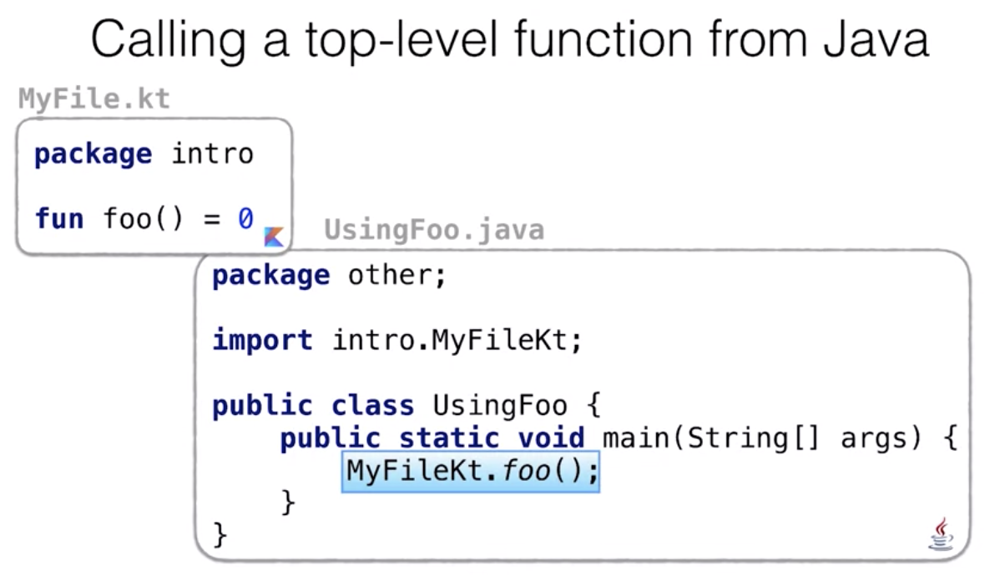
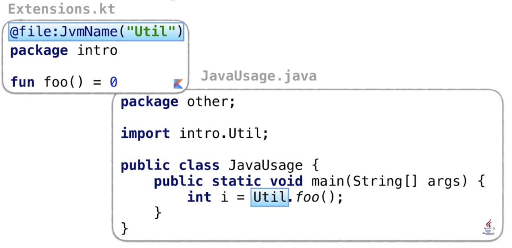

# kotlin for java developers

Created: Jul 24, 2019 2:15 PM

# week2

## Basics

### Hello, world

**top-level functions** 

- 함수를 최상위 레벨에 선언할 수 있음
- 모든것을 클래스 내에 넣을 필요가 없음
- 특정 클래스에 바인딩 될 필요 없는 제네럴한 함수 들이 있다면 그냥 패키지 레벨에 정의하면 됨

**main with or without args** 

- `fun main() { ... }` // kotlin 1.3 부터 args 생략 가능

**if expression**

- 코틀린에서 if는 표현식
- if의 결과를 변수에 지정하거나 함수에서 반환 가능
- `val name = if (args.size>0) args[0] else "Kotlin"`

**string templates**

- ${functionCall(...)}

    fun main(args: Array<String>) {
    	println("Hello, ${args.getOrNull(0)}!")
    }

- null이 들어갈경우 Hello, null!이 출력됨
- kotlin은 java.lang.String사용
- java - `System.out.println("Hello, " + null + "!")` 과 동일한 로직 null을 String "null"로 변환
- `println("Hello, ${null}!")`

## Variables

**val** 

- value, read Only, can't be reassigned
- Java의 final 키워드

**var** 

- variable, mutable

코틀린은 정적 타입 언어

- 모든 변수, 표현식은 타입을 가짐
- type이 없거나 unkown이라는 의미가 아님
- context에서 타입이 명확하다면 컴파일러가 추론하는 타입을 신뢰할 수 있음

잘 이해안되는 Q

Is it possible to modify an object stored in val?

할당된 객체 자체를 바꿀수는 없지만 객체의 내용은 수정가능하다는  뜻..?

as in Java.l 'val', likea `final` variable, is animmutavle reference which doesn't say anything about the content that is stored

val doesn't give you any guarantees about the content stored  in  an object.

**List: mutable & read-only**

    val mutableList  = mutableListOf("Java")
    mutableList.add("Kotlin")
    
    val readOnlyList = listOf("Java")
    readOnlyList.add("Kotlin") // error
    // read-only 리스트는 add 같은 메소드 없음

새로운 변수를 선언할때에는 'val 키워드를 쓰도록 노력

사이드 이펙트 없이 immutable references, immutable objects and functions를 사용하세요

### Functions

    fun max(a: Int, b: Int): Int  {
    	return if (a > b) a else b
    }
    
    // 함수가 단순히 하나의 표현식을 반환하는 경우
    // fuction with expression body 로 변환가능 
    fun max(a: Int, b: Int) : Int = if (a > b) a else b
    
    // 리턴 타입 생략 가능
    fun max(a: Int, b: Int) = if (a > b) a else b

Function returning Unit

리턴 타입을 생략하는 경우, 이는 함수가 'Unit'을  반환함을 의미 

Functions everywhere

코틀린에서는 함수를 어디서나 선언할 수 있음

    fun topLevel() = 1 // Top-level func
    class A {
    	fun member = 2   // member func
    }
    fun other()  {
    	fun local() = 3  // local func
    }

Q. Java에서  top-level 함수를 호출하는 것은 가능할까?  가능하다면 어떻게 가능할까?

A. 파일 이름과 상응하는 클래스의 static 함수로써  호출 가능

또는  `import static intro.MyFileKt.*`하고 foo()만 호출

@JvmName

최상위 함수를 포함하고있는 클래스의 JVM 이름을 변경할수 있음

### Named & default  arguments

Functions: default values

    fun display(character: Char = '*', size: Int = 10)  {
    	repeat(size) {
    		print(character)
    	}
    }

만약 앞에는 default값 사용하고 뒤에 size만 명시하고싶다면

`display(size = 5)`  처럼 사용(named argument)

named argument를 사용한다면파라미터의 순서상관 x

만약 자바에서 디폴트 인자가 있는 함수를  호출하는 경우에는 어떻게 될까

fun sum(a: Int = 0, b: Int = 0)

→ have to specify the values for all the arguments

→ `sum(1, 2)`

By default, Kotlin generates the function with all the argument, and only one additional auxiliary function containing information about all the default values, which you can't call from Java.

@JvmOverloads

- default arg 를 사용하는  코틀린함수에 해당 어노테이션을  붙이면 java에서도 코틀린 함수의 default  arg  사용 가능

## Control Structures

**Conditionals: if & when**

if

- kotlin에서 if는 표현식
    - val max= if (a > b) a else b
    - 변수에 할당 할 수 있는 값을 반환함을 의
- kotlin에는 3항연산자(ternary  operator 존재 x)

when

- break문 불필요
- 동일한 값을 쉼표로 구분하여 나열할 수 있음

    fun respondToInput(input: String) = when (input) {
    	"y", "yes" -> "agree" // 값을 쉼표로 구분해 나열 가능
    	"n", "no" -> "sorry"
    	else -> "can't understand"
    }

- 어떠한 표현식도 branch condition으로 사용할 수 있음

    fun mix(c1: Color, c2: Color) =
    	when (setOf(c1, c2)) {
    		// color의 순서는 무시하기위해 set 사용
    		setOf(RED, YELLOW) -> ORANGE
    		setOf(YELLOW, BLUE) -> GREEN
    		else -> thorw Exception("Dirty color")
    	}

- 타입 체크(is checks == java의 instanceof)

    when (pet) {
    	is Cat -> pet.meow() // pet을 cating할 필요 x
    	is Dog -> pet.woof() // start cast!
    }
    // java에서는 cating필요 
    if (pet instanceof Cat) 
    	((Cat) pet).meow();

- Capturing when subject in a variable

    `when (val pet = getMyFavoritePet())`

    pet 키워드는 when 절 안에서만 보임 

- when without argument

    fun upedateWheather(degress: Int) {
    	val (description, color) = when {
    		degrees < 5 -> "cold" to BLUE
    		degrees < 23 -> "mild" to ORANGE
    		else -> "hot" to RED
    	}
    }

when절에 인자가 없다면 어떠한 Boolean 표현식을 branch condition으로 사용할 수 있음

**Loops**

    for ((key, value) in map) {
    	println("$key = $value")
    }
    
    for ((index, element) in list.withIndex()) {
    	println("$index: $element")
    }

**'in' checks & ranges**

java에는 없는 유용한 기능

in으로 바운즈 체크 

`fun isLetter(c: Char) = c in 'a'..'z' || c in 'A'..'Z'`

→  `'a' <= c && c <= 'z'`

`!in`도 가능 -> not in the range

`val charRange: CharRange = 'a'..'z'`

`val stringRange: ClosedRange<String> = "ab".."az"`

Q. println("Kotlin" in "Java" .. "Scala")

→ true

in 검사는 단순히 바운즈를 검사하는 코드로 변환됨

즉 "ball " in "a".."k"는

"a" ≤  "ball" && "ball" ≤ "k"로 변환 

그리고 내부에서는 자바처럼 string을 비교하는 함수가 호출됨

"a".compareTo("ball") ≤ 0 && "ball".comareTo("k") ≤ 0

문자열은 기본적으로 사전 식으로 또는 알파벳 순서로 비교 됨

can define a range of any comparable elements

& range check works with every comparable type

**Exceptions**

한가지 중요한 차이점을 제외하고는 자바와 동일함

No difference between checked and unchecked exceptions

    val number = try {
    	Integer.parseInt(string)
    } catch (e: NumberFormatException) }
    	return
    }

thorw 와 try 는 kotlin에서는 expression

kotlin에는 checked exception이 없기 때문에 특정한 함수가 어떠한 예외를 발생시킨다는 것을 명시할 필요가 없음

하지만 throws annotation으로 표현가능 

→ 필요없다더니 이러한 어노테이션은 왜 만들었을까 ?

`fun foo { throw IOException() } // kt`

    fun foo { throw IOException() } // kt
    
    @Throws(IOException::class)
    fun bar { throw IOException() } // kt
    
    try {
    	DemoKt.foo(); // call kotlin function
    	DemoKt.bar(); // OK
    } catch (IOException e) {
    	// error, try 블럭에서 IOException은 절대 오지 않으므로(never thrown)
    }

## Extensions

### Extension Functions

Extension function은 class를 extend 함 

class의 외부에 정의되지만 해당 클래스의 일반 멤버인것처럼 호출할 수 있음

`fun String.lastChar() = this.get(this.length - 1)` 처럼 선언하고 멤버함수처럼 사용할 수있음 

`val c: Char = "abc".lastChar()`

위 예제에서 String은 lastChar()함수의 리시버, this 레퍼런스를 통해서 리시버에 접근할 수 있음 and 생략 가능 

중요한 점은 확장함수를 아무데서나 선언하고 사용할 수 없다는 것 

사용시에는 명시적으로 임포트해야함

Calling Extension Functions from Java code

위의 lastChar() 함수가 StringExtenstions.kt에 선언되어있다고  가정

최상위 함수를 자바에서 호출할때, 이는 단순히 static function 이었던 것처럼, 동일 함 

`import static StringExtensionsKt.lastChar;` or `StringExtensionsKt.lastChar()`

Q. 그렇다면 확장함수에서 private 멤버에 접근할 수 있는가?

A. no

java에서와 마찬가지로 동일 클래스 내에서만 private멤버 호출가능, java에서는 클래스 외부에 선언된 static 함수가 private멤버를 호출하지 못함

kotlin 확장 함수는 regular static functions 분리된 auxiliary 클래스에 정의된, 그러므로 extensions에서는 private member 호출할 수 없음

Kotlin extension functions are most of the time top-level functions defined in a special extra file which content is compiled to the corresponding extra class.

### Examples from the Standard Library

Kotlin standard library 

= Java standard library + extensions

→ 자바와 코틀린 사이에서 매우 부드러운 상호 운용성을 제공함

ex val set = hashSetOf(1,  7, 53)

println(set.javaClass) // class java.util.HashSet

내면에서는 java.util 팩키지의 Java  표준 콜렉션 클래스가 사용됨

확장 함수 예제들

- `joinToString()`
- `getOrNull()`
- `withIndex()`
- `until` - infix로 정의 되어있음

    `until(10)`으로도 호출가능하고

    infix form으로 dot와  괄호를 생략해 `until 10`으로도 호출가능

- `to` - simply return pair of value, infix

- `toRegex()`  - convert string to regex
- `""" [ 이안에서는 `\`같은거 써도 이스케이프 필요 x] """`

conversion to numbers

`"123".toInt()` // 123

`"xx".toInt()` // Number Format Exception

`"xx".toIntOfNull` // null

### Calling Extensions

어떻게 extensions가 상속과 상호 작용하는 방법 및 extensions가 멤버를 숨길 수 잇는지에 대해 이해

Extensions are static Java functions under the hood

→ No override for extension functions in  Kotlin

왜냐하면 컴파일러가 호출될  올바른 함수를 선택할때, 수신자의 표현식의 타입만을 사용하지 실제로  저장된 값을 보지 않으므로  

Q.만약 멤버와 중복되는 extension을 정의하면 어떻게되는지(오버라이드)

A.만약 시그니처가 동일하다면 무시되고 항상 멤버가 이김

If you try to define extension with the same signature as a member, then you get a warning that an extension is shadowed, so the member will always be chosen instead.

즉 오버로딩은 가능

### Importance of extensions