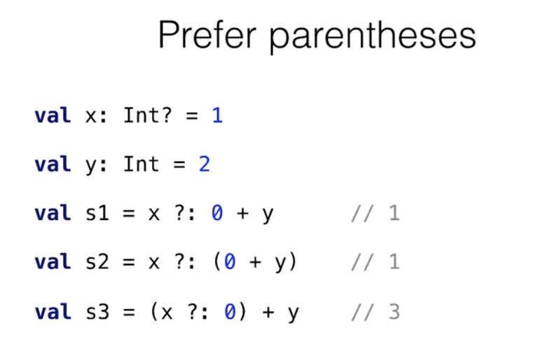
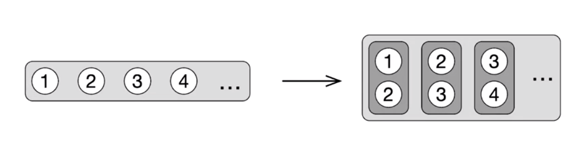

# Week3 Nullability, Functional Programming

## Nullability

### Nullable types(important)

코틀린은 nullable과 non-nullable 타입을 구분함

현대적인 접근 :  NPE를 런타임 에러가 아닌, **컴파일 타임 에러**로 만들기

`?`를 붙이면 nullable 타입

**nullable 타입 오브젝트를 역참조 하고 싶다면?**

- 참조하는 객체가 null 이 아님을 명시적으로 체크 `if (s ≠ null)`

- (추천) **safe expression**(safe call) ->  `?.`

  receiver가 null이 아닌지를 검사, null이 아닐경우 필요한 멤버를 호출하고 결과 전달

  receiver가 null일 경우, 결과는 null이 됨
  
  `val length: Int = s?.length ?: 0`
  
  -> 값이 null일때는 `?:` 연산자가 제공하는 디폴트 값 사용

- 엘비스 연산자를 포함한 모든 nullability 연산자는 Groovy에서 옴

  null일 수 있는 표현식을 다루는데 매우 유용한 것으로 입증 됨

  

**명시적으로 NPE 를 던지고 싶은 경우**

→ `s!!`

operand가 null일경우 NPE를 던지지만,, by default, try to avoid it.

We have it in the language, especially for other use cases where the Kotlin compiler isn't smart enough to infer the right time.

표현식이 null이 아니라 가정하지만 코틀린 컴파일러가 이를 추론할 수 없는 경우에 사용하세요.(늦게 초기화 되지만 무조건 null이 아닌 경우가 있을 수도 ..)



`?:`의 연산자 우선순위가 + 보다 낮음, 혼동되지 않도록 꼭 괄호를 사용할 것


### Nullable types under the hood

**Nullable types != Optional**

Nullability 문제에 대한 다른 대안책으로 Optional(Option types) 이 있음

둘은 동일한 문제를 해결하지만 performance에서 매우 다름

Optional type is a wrapper that stores the reference to the initial object.

각각의 optional value에 대해 **추가적인 객체가 생성**됨

하지만  **nullable 타입은 어떠한 wrapper로 만들지않고, annotaions에 의해 구현**됨

-> 즉 성능에 오버헤드가 없음

ex ) optional의 경우 String 값을 저장하는 객체 + nullable String을 저장하는 wrapper

총 두개의 객체를 생성하게 됨 

```java
fun foo(): String = "foo" // 내부적으로 이 함수는 컴파일시에만 확인하는 annotation이 추가됨
fun bar(): String? = "bar"
  
@NotNull
public static final String foo() { return "foo"; }

@Nullable
public static final String bar() { return "bar"; }
```

런타임시 둘은 annotation만 다른 동일한 java String임,  no wrap 

모든 체크는 어노테이션의 도움을 받아 컴파일 타임에 이루어짐


**List of nullable elements vs nullable list**

`List<Int?>` - list의 element가 null을 가질 수 있음

`List<Int>?` -  list 이거나(즉 not null) 또는 null임(list itself is null)

```kotlin
fun foo(list1: List<Int?>, list2: List<Int>?) { 
  list1.size
  list2?.size

  val i: Int? = list1.get(0)
  val j: Int? = list2?.get(0) // nullable
}
```


### Safe casts

표현식을 타입으로 캐스트하는 안전한 방법

- `is` : instanceof
- `as` : typecast

```kotlin
if (any is String) { // type cast를 safe cast로 대체할 수 있음
  any.toUpperCase()
}

// type cast는 표현식이 cast되지 않는 경우 exception을 냄
// 동일한 경우 ?을 달고있는 safe cast는 null을 리턴함 
(any as? String)?.toUpperCase()
```


### Importance of nullability

Q. 왜 nullability가 그렇게 중요한가요?

A. 타입 시스템에서의 nullability는 코틀린의 주요 피쳐 중 하나

많은 null들이 주위에 있기 때문에 중요함 -> "billion dollar mistake"

null을 다루는 것을 쉽게 만들어줌 

null을 사용해 부재를 표현하는 것은 불법적이었지만, 코틀린에서는 합법적임

-> 왜냐하면 타입 시스템이 그것을 추적할 수 있도록 도와주기 때문에


## Functional Programming

### Lambdas

Lambda is an anonymous function that can be used as an expression.

java에서는 익명 클래스가 동일한 목적을 위해서 사용 되었음

java 8에서부터도 지원..  filter나 map등 사용하여 가독성을 좋게 할 수 있음


**Lambda syntax**

`{ x: Int, y: Int -> x + y }` 코틀린에서 람다는 항상 중괄호 안에 있음 

첫째로 파라미터를 정의하고, `->` 에서 body를 정의 

람다를 아규먼트로 넘길때

- `list.any({ i:Int -> i > 0})` 괄호 안에도 full syntax

- 마지막 아규먼트가 람다인 경우에는 괄호 밖으로 람다를 뺄 수 있음

  `list.any() { i:Int -> i >0 }`

  그리고 `()`가 비어있는 경우에는 생략가능

  즉 `list.any { i:Int -> i > 0 }` 로 표현할 수 있음

- context로부터 type이 명확한 경우에는 해당 type을 생략할 수 있음

  즉 `list.any { i -> i > 0 }`

- 람다가 자신의 argument를 가지며, 해당  argument의 갯수가 1개일 경우 argument의 이름을 `it`으로 대체 가능

  `list.any { it > 0 }`


**Destructuring declarations**

아규먼트가 map entry 또는 pair일 경우

`map.mapValues { entry -> "${entry.key} -> ${entry.value}!" }`

대신에 두개의 파라미터를 한번에 선언

`map.mapValues { (key, value) -> "$key -> $value!" }`

만약 두개의 변수 중에서 사용하지 않는 변수가 있다면 `_`로 대체할 수 있음

가독성이 좋아지고, 사용하지 않는 변수를 위해 이름을 부여할 필요도 없음

`map.mapValues { (_, value) -> "$value!" }`


### Common Operations on collections

- `filter` : 말 그대로 필터, 주어진 조언에 만족하는 애들만 남김
- `map` : 원소들을 조건을 적용해서 내보냄, 반환값은 list

**all, any, none ard interchangeable**

- `all` : 모든 원소가 주어진 조건에 만족하면 true

- `any` : 주어진 조건을 만족하는 원소가 적어도 한개 이상이면 true

- `none` : any의 반대

- `find` : 조건을 만족하는 첫번째 원소 반환, 없으면 null

- `first` : find랑 동일, 만족하는 원소가 없으면 exception

- `firstOrNull` : find랑 동일, 만족하는 원소가 없으면 null

- `count` : 주어진 조건을 만족하는 원소의 갯수를 반환

- `pritition` : 조건을 만족하는 리스트 / 만족하지 않는 리스트 두개를 반환 

  - `filter`는 만족하는 것만 반환!
  - `val (youngest, oldest) = heroes.partition { it.age < 30 }`

- `groupBy `: 콜렉션을 두가지 이상의 그룹으로 나누고 싶은 경우

- `associateBy` : key가 유니크 할 때 사용하면 좋음, **중복되는 키를 가지는 원소는 삭제됨!(마지막 것만 남는다)**

- `associate` : build a map based on a list

- `zip` : 두개의 리스트의 원소들을 쌍쌍이 엮어 새로운 리스트

  - 만약 두개의 리스트의 길이가 다를경우 짧은쪽으로 맞춰짐

- `zipWithNext`

  

- `flatten` : 리스트들로 이루어진 리스트에서 호출, 모든 리스트들을 하나의 리스트로 만듦

- `flatMap` : map + flat, map 처리 이후의 결과가 list인경우 해당 list의 원소들을 펼쳐 다시 list로 만듦

- `maxBy`, `minBy` : 리스트가 비어있을 경우에는 null 반환

- `getOrElse`

  

**map[key] vs map.getValue(key)**

`map["notExistKey"]?.age` -> return null 

`map.getValue("notExistKey").age` -> throw NoSuchElementException


### Function Types

코틀린에서는 람다를 변수에 저장할 수 있음

ex) `val sum = { x: Int, y: Int -> x + y }`

이때 sum 의 타입은 뭘까? 명시적으로 지정하자면 다음과 같다

`val sum: (Int, Int) -> Int = { x, y -> x + y }`

파라미터의 타입이 () 안에 작성되고, 리턴타입이 -> 다음에 작성됨 

 `val isEven: (Int) -> Boolean = { i: Int -> i % 2 ==0 }  `


람다 호출을 미루어야하는 경우 유용함

변수에 저장해두었다가 함수의 argument


람다를 직접 호출시에는 람다 바디 뒤에 `()`를 붙여야하는데, 이상하니까 `run` 을 이용해라

```kotlin
{ println("hey") }()
run { println("hey") } // 위 코드와 동일하지만 more readable
```


Java에서는 SAM 인터페이스 대신 람다를 넘길 수 있음


**Function types and nullability**

```kotlin
() -> Int? // return 타입이 nullble이다.
(() -> Int)? // the variable is nullable(the whole type nullable)
```

그렇다면 

`val f: (() ->Int)? = null` 인 람다 함수를 호출 하고 싶은 경우에는 어떻게?

함수가 nullable이기 때문에 `f()` 처럼은 호출 할 수 없음

- null 이 아님을 명시적으로 확인 `if (f != null)`
- 또는 safe access 문법 `f?.invoke()`


### Member References

문법은 자바와 동일하게 `Class::member`

람다와 달리 함수(fun)는 변수에 어사인 할 수 없음

```kotlin
fun isEven(i: Int): Boolean = i % 2 == 0
val predicate = isEven // error
// 대신에 function reference를 사용
val predicate = ::isEven
// 이러한 문법은 단지 람다 내에서 함수를 호출하는 또 다른 방법이며, 내부 구현은 동일
val predicate = { i: Int -> isEven(i) }

// 그렇다면 굳이 위에 처럼쓰는 이유는
val action = { person: Person, messge: String -> sendEmail(person, message)} 
// 이 처럼 함수가 여러개의 인자를 가지는 경우 모든 파라미터의 이름을 람다의 파라미터로 다시 써 주어야하고, 명시적으로 넘겨주어야함
// 이처럼 member ref를 통해 모든 파라미터들을 숨길 수 있음(컴파일러가 대신 추론)
val action = ::sendEmail
```

함수 레퍼런스를 인자로 넘길 수 있음

```kotlin
fun isEven(i: Int): Boolean = i % 2 == 0
val list = listOf(1,2,3,4)
// 람다가 길 경우에는 이렇게 뺀 다음 refrence로 넘기는 것이 합리적
list.any(::isEven)
list.filter(::isEven)
```


**Bound & non-bound refrences**

코틀린에서는 bound 레퍼런스를 만들 수 있음

**non-bound ref** : 특정한 인스턴스에 종속(bound) 되어있지 않음

```kotlin
class Person(val name: String, val age: Int) {
	fun isOlder(ageLimit: Int) = age > ageLimit
}

// Person::isOlder는 regula non-bound ref
val agePredicate: (Person, Int) -> Boolean = Person::isOlder
		// 이 람다는 person과 ageLimit을 두가지 argument로 취함
		// 단순히 person의 멤버 함수를 호출	
		= { person, ageLimit -> person.isOlder(ageLimit) }
val agePredicate = Person::isOlder

val alice = Person("Alice", 29)
agePredicate(alice, 21) // true
```

**bound ref** : 클래스의 특정 인스턴스에 attach되어있는 레퍼런스

```kotlin
val alice = Person("Alice", 29)
// 위와는 다르게 person parmeter가 없는데, 이미 세팅되어있기 때문에 
val agePredicate: (Int) -> Booleadn = alice::isOlder
	// 실제 람다의 구현도 다음과 같이 bound된 인스턴스의 멤버 함수를 호출하게됨
	= { ageLimit -> alice.isOlder(ageLimit) }
val agePredicate = alice:isOlder // alice라는 특정 인스턴스에 attach
agePredicate(21)
```


member refrence는 **this**에 bound될 수 있음

```kotlin
class Person(val name: String, val age: Int) {
  fun isOlder(ageLimit: Int) = age > ageLimit
  fun getAgePredicate() = this::isOlder // usual omit this 
  // this::isOlder의 타입은 (Int) -> Boolean 
}

```


### return from Lambda

Returning Kotlin always returns from a function marked with fun.

```kotlin
fun duplicateNonZero(list: List<Int>): List<Int> {
  return list.flatMap {
    if (it == 0) return listOf() // 리스트에 0이 있기만 하면 항상 빈 list가 return
    listOf(it, it) // 여기서 무슨짓을 해도 return되지 않고, outer에서 return
  }
}
```

이렇게 구현되어있는 이유

왜 코틀린의 return은 outer 함수에서 return될까

```kotlin
// 다음과 같은 함수를 생각
fun containsZero(list: List<Int>): Boolean {
  for (i in list){
    // 이때 return은 단순히 returns from the function
    if (i == 0) return true 
  }
  // 만약 이 list for loop을 foreach로 바꿀 경우
  // 이 return이 위의 return과 동일하게 동작할 것 이라는걸 예상할 수 없음
  // forEach는 람다여서
  list.forEach {
    if (i == 0) return true
  }
  return false
}
```


그렇다면 람다에서 return 하고 싶은 경우에는 어떻게 해야할까?

labels returns syntax를 사용

```kotlin
list.flatMap {
  if (it == 0) return@flatMap listOf<Int>() // 대응하는 람다의 리턴
  listOf(it, it)
}
// 만약 라벨이름을 바꾸고싶은경우
list.flatMap anyLableName@{
  if (it == 0) return@anyLableName listOf<Int>()
}
```

또다른 문제 해결법

- 람다를 사용하지 않고 local function 사용(fun안에 fun)

- 익명 함수 사용(좋은 방법인지는 잘 모르겠다. local fun 이름을 안지어줘도됨 )

  람다의 alternative syntax로 컴파일된 바이트 코드는 동일 

  fun에 리턴되고, 람다와는 다르게 리턴타입을 명시 할 수 있음

  ```kotlin
  fun duplicateNonZero(list: List<Int>): List<Int> {
    return list.flatMap(fun (e): List<Int> {
      if (e == 0) return listOf()
      return listOf(e, e)
    })
  }
  ```

- 때때로는 return을 사용하지 않아도 됨

  ```kotlin
  fun duplicateNonZero(list: List<Int>): List<Int> {
    return list.flatMap {
      if (e == 0) listOf()
      else listOf(e, e)
    })
  }
  ```


### Nice String

```kotlin
package nicestring

fun String.isNice(): Boolean {
//    var count = 0
//    if (!(this.contains("bu")
//            || this.contains("ba")
//            || this.contains("be")))
//        count++
//
//    val condition2 = this.count {
//        it == 'a' || it == 'e' || it == 'i' || it == 'o' || it == 'u'
//    }
//    if (condition2 >= 3)
//        count++
//
//    var c = 0
//    for (i in 0 until this.length - 1) {
//        if (this[i] == this[i+1])
//            c++
//    }
//    if (c >= 1)
//        count++
//    return count >= 2

    //val noBadSubstring = !contains("ba") && !contains("be") && !contains("bu")
    // setOf("ba", "be", "bu").all { !this.contains(it) }
    val noBadSubstring = setOf("ba", "be", "bu").none { this.contains(it) }


//    val hasThreeVowels = count {
//        it == 'a' || it == 'e' || it == 'i' || it == 'o' || it == 'u'
//    } >= 3
    // setOf가 성능면에서 살짝 더 좋지만 문자가 5개이기때문에 크게 차이는 없음
    //val hasThreeVowels = count { it in setOf('a', 'e', 'i', 'o', 'u') } >= 3
    val hasThreeVowels = count { it in "aeiou" } >= 3

//    var hasDouble = false
//    if (length > 1) {
//        var prevCh: Char? = null
//        for (ch in this) {
//            if (ch == prevCh)
//                hasDouble = true
//            prevCh = ch
//        }
//    }

   // (0 until lastIndex).any { this[it] == this[it + 1] }
    val hasDouble = zipWithNext().any { it.first == it.second }
    // or use windowed
    //windowed(2).any { it[0] == it[1] }

//    var conditions = 0
//    if (noBadSubstring) conditions++
//    if (hasThreeVowels) conditions++
//    if (hasDouble) conditions++
//
//    return conditions >= 2

    return listOf(noBadSubstring, hasThreeVowels, hasDouble).count { it } >= 2
}
```


### Taxi Park

```kotlin
package taxipark

/*
 * Task #1. Find all the drivers who performed no trips.
 */
fun TaxiPark.findFakeDrivers(): Set<Driver> =
        allDrivers - trips.groupBy { it.driver }.keys

// 각각의 driver에 대해 none을 호출
fun TaxiPark.findFakeDrivers2(): Set<Driver> =
        allDrivers.filter { driver -> trips.none { it.driver == driver } }.toSet()

// map을 한번만 순회하기 때문에 좀더 효율적임
fun TaxiPark.findFakeDrivers3(): Set<Driver> = allDrivers - trips.map { it.driver }
// 워스트 케이스가 아니라면 2,3 모두 크게 차이는 없음

/*
 * Task #2. Find all the clients who completed at least the given number of trips.
 */
fun TaxiPark.findFaithfulPassengers(minTrips: Int): Set<Passenger> =
        allPassengers.filter { passenger ->
            trips.count { passenger in it.passengers } >= minTrips
        }.toSet()

fun TaxiPark.findFaithfulPassengers2(minTrips: Int): Set<Passenger> =
        trips.flatMap { it.passengers }
                .groupBy { it }.filter { it.value.size >= minTrips }
                .map { it.key }.toSet()

fun TaxiPark.findFaithfulPassengers2_1(minTrips: Int): Set<Passenger> =
        trips.flatMap(Trip::passengers) //  람다를 reference로 변환
                .groupBy { passenger -> passenger } // 가독성을 높인다면 반복해도 상관 x
                .filterValues { group -> group.size >= minTrips } //.filter { (_, group) -> group.size >= minTrips } // entry destruction 선언이 하나의 변수보다 나음
                .keys // map{it.key}.toSet() 대신에 바로 keys로 접근 가능

/*
 * Task #3. Find all the passengers, who were taken by a given driver more than once.
 */
fun TaxiPark.findFrequentPassengers(driver: Driver): Set<Passenger> =
        trips.filter { it.driver == driver }
                .flatMap { it.passengers }
                .groupBy { it }
                .filter { it.value.size > 1 }
                .keys

fun TaxiPark.findFrequentPassengers2(driver: Driver): Set<Passenger> =
        trips.filter { trip -> trip.driver == driver }
                .flatMap(Trip::passengers)
                .groupBy { passenger -> passenger }
                .filterValues { group -> group.size > 1 }
                .keys

fun TaxiPark.findFrequentPassengers3(driver: Driver): Set<Passenger> =
        allPassengers.filter { passenger ->
            trips.count { it.driver == driver && passenger in it.passengers } > 1
        }.toSet()

/*
 * Task #4. Find the passengers who had a discount for majority of their trips.
 */
fun TaxiPark.findSmartPassengers(): Set<Passenger> =
        allPassengers.filter { passenger ->
            trips.filter { passenger in it.passengers && it.discount != null }.size >
                    trips.filter { passenger in it.passengers && it.discount == null }.size
        }.toSet()

fun TaxiPark.findSmartPassengers2(): Set<Passenger> {
    // destructive 선언이 낫다.
    //val pair = trips.partition { it.discount is Double }
    val (tripsWithDiscount, tripsWithoutDiscount)
            = trips.partition { it.discount != null }

    // and use in instead of contains (same same)
    return allPassengers.filter { passenger ->
        tripsWithDiscount.count { passenger in it.passengers } > tripsWithoutDiscount.count { passenger in it.passengers }
    }.toSet()
}

fun TaxiPark.findSmartPassengers2_1(): Set<Passenger> =
        allPassengers.associateBy( // groupby 대신, key가 유니크 하다면
                { it },
                { p -> trips.filter { t -> p in t.passengers } }
        ).entries.filter {
            val group = it.value
            val (with, without) = group.partition { it.discount != null }
            with.size > without.size
        }.map { it.key }.toSet()

fun TaxiPark.findSmartPassengers2_2(): Set<Passenger> =
        allPassengers.associate { p ->
            // associateBy 대신 람다 하나 인자로 받는 associate
            p to trips.filter { t -> p in t.passengers }
        }.filterValues { group ->
            val (with, without) = group.partition { it.discount != null }
            with.size > without.size
        }.keys

fun TaxiPark.findSmartPassengers3(): Set<Passenger> =
        allPassengers.filter { p ->
            val withDiscount = trips.count { t -> p in t.passengers && t.discount != null }
            val withoutDiscount = trips.count { t -> p in t.passengers && t.discount == null }
            withDiscount > withDiscount
        }.toSet()

/*
 * Task #5. Find the most frequent trip duration among minute periods 0..9, 10..19, 20..29, and so on.
 * Return any period if many are the most frequent, return `null` if there're no trips.
 */
fun TaxiPark.findTheMostFrequentTripDurationPeriod(): IntRange? {
    if (!trips.isNullOrEmpty()) {
        val maxTime = trips.groupBy { it.duration / 10 }.maxBy { it.value.size }!!.value[0].duration
        val end = maxTime - maxTime.rem(10) + 10
        return (maxTime - maxTime.rem(10)) until end
    }
    return null
}

fun TaxiPark.findTheMostFrequentTripDurationPeriod2(): IntRange? {
    return trips.groupBy { it.duration / 10 * 10..it.duration / 10 * 10 + 9 }
            .toList()
            .sortedByDescending { it -> it.second.size }
            .firstOrNull()
            ?.first
}

fun TaxiPark.findTheMostFrequentTripDurationPeriod2_1(): IntRange? {
    return trips
            .groupBy {
                val start = it.duration / 10 * 10
                val end = start + 9
                start..end
            }
            .maxBy { (_, group) -> group.size }
            ?.key
}

/*
 * Task #6.
 * Check whether 20% of the drivers contribute 80% of the income.
 */
fun TaxiPark.checkParetoPrinciple(): Boolean {
    if (trips.isNullOrEmpty()) return false
    val group = trips.groupBy { it.driver }.mapValues { it.value.sumByDouble { trip -> trip.cost } }
    val totalIncome = group.values.sum()
    val sorted = group.toList().sortedByDescending { it.second }.toMap()

    var driverNum = 0
    var sum = 0.0
    for (value in sorted.values) {
        driverNum++
        sum += value
        if (sum >= (totalIncome * 0.8)) break
    }

    return driverNum <= (allDrivers.size * 0.2)
}

fun TaxiPark.checkParetoPrinciple2(): Boolean {
    if (trips.isEmpty()) return false

    val totalIncome = trips.sumByDouble(Trip::cost) // property ref
    val sortedDriversIncome: List<Double> = trips
            .groupBy(Trip::driver)
            .map { (_, tripsByDriver) -> tripsByDriver.sumByDouble(Trip::cost) }
            .sortedDescending()

    val numberOfTopDrivers = (0.2 * allDrivers.size).toInt()
    val incomeByTopDrivers = sortedDriversIncome
            .take(numberOfTopDrivers)
            .sum()

    return incomeByTopDrivers >= 0.8 * totalIncome
}

```

