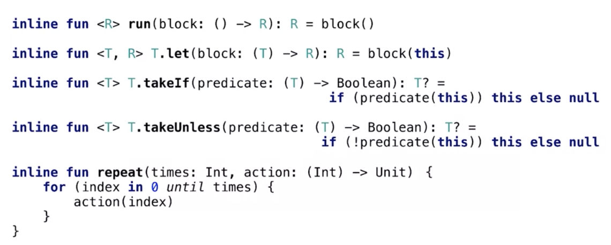
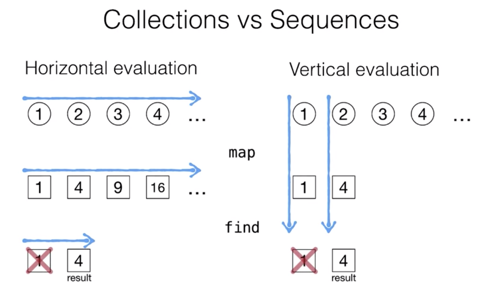
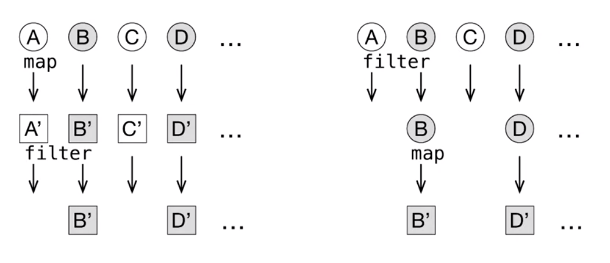
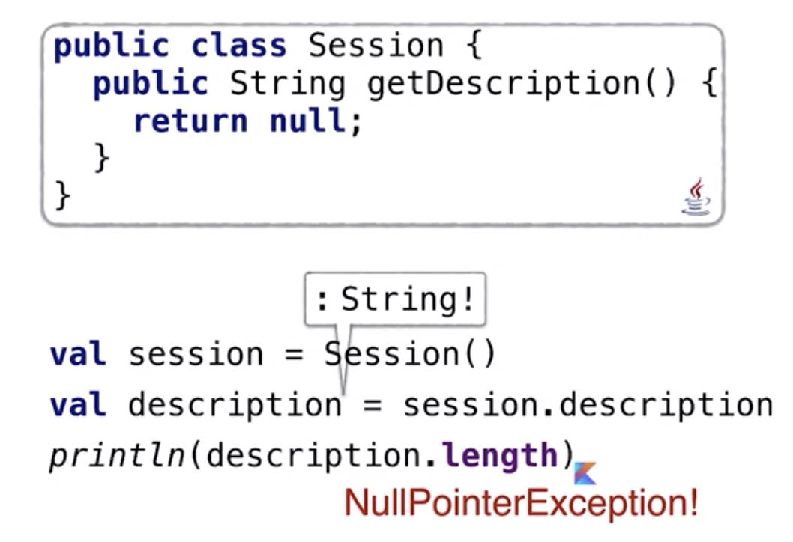

# Week5

## Inline functions

### Library functions looking like built-in constructs

인라인의 매커니즘이 어떻게 라이브러리 함수를 내장된 언어의 구성처럼 보이게 만드는지

내부에서, 람다는 성능 오버헤드 없이 inline 될 수 있으며 이것이 의미하는 것이 무엇이고, 

inling이 어떻게 동작하며, 왜 중요한지 알아 볼 것 


퍼포먼스 저하없이 사용할수 있는 유용한 라이브러리 함수들

- **run** function

  runs the block of code(lamda) and return the last expression as the result

  이는 단지 람다를 아규먼트로 받는 라이브러리 함수임

- **let** function

  allows to check the argument for being non-null, not only the receiver

  ```kotlin
  fun analyzeUserSession(sesstion: Session) {
    val user = session.user // to smart cast, capter user to new local variable
    if (user is FacebookUser) {
      println(user.accountId)
    }
    
    // 위 코드를 아래의 let function으로 대체 가능
    (session.user as? FacebookUser)?.let {
      println(it.accountId)
    }
  }
  ```

- **takeIf** function

  returns the receiver object if it satisfies the given predicate, otherwise return null

  issue.

  ```kotlin
  issue.takeIf { it.status == FIXED }
  person.patronymicName.takeIf(String::isNotEmpty)
  ```

  chanied 호출에서 매우 유용함

  반대인 **takeUnless** 도 존재

- **repeat** function

  주어진 횟수만큼 액션을 반복함, index가 필요없는 for-loop 대신 사용 

  ```kotlin
  repeat(10) {
    println("Welcome!")
  }
  ```


이러한 모든 함수들은 **inline** 함수로 정의되어 있음 -> 그러므로 성능 저하는 없음!




### The power of inline 

```kotlin
// inline modifier 없이 함수를 정의 
fun myRun(f: () -> Unit) = f()
fun main() {
  val name = "Kotlin"
  // 람다를 인자로 받는 함수의 경우, 내부적으로는 람다를 저장하기 위해 익명 클래스가 생성됨
  // 만약 람다가 변수를 캡쳐하는 경우, 캡쳐된 변수의 컨텐츠를 저장하기 위해 매 호출마다 새로운 객체가 생성됨
  myRun { println("$name") } // 아래 단순 프린트 문에 비해 퍼포먼스에 오버헤드가 있음
  println("$name") 
}
```

**inline** function

compiler **substitues** a body of the function instead of calling it

 

Resource management: use function 

```kotlin
fun readFirstLineFromFile(path: String): String {
  // Java에서의 try-with-resources syntax 대체가능
  // 올바르게 resource를 닫는 로직을 포함하고 있음 
  BufferedReader(FileReader(path)).use { br ->
    return br.readLine()
  }
}
```


inlining은 kotlin 컴파일러의 피쳐이므로 자바에서 해당 인라인 함수를 호출하면 인라이닝 되지 않음


@InlineOnly

Specifies that this function should not be called directly without inlining

앱을 빌드할때 jar파일에 저장되지 않으며 앱의 사이즈를 줄일 수 있음

Java 에서 호출 할 수 없으며 오직 코틀린에서만 visible and accessible


inlining의 단점

- size of the resulting application
- 왜냐하면 inline 함수는 호출될때마다 하나의 함수가 호출되는 것이 아니라 전체 body가 대체되기 때문에, 오직 작은 함수만이 인라인 되어야함 


## Sequences(12/20)

### Collections vs Sequences

collection의 모든 extensions들은 인라인 함수임(filter, map, any, find ... )

- 그리고 새로운 colletion을 반환함 

- 하지만 그러한 호출들이 여러번 반복되면 문제가 생길 수 있음(매번 새로운 리스트를 만드므로)

  > but, intermediate collections are created for chained calls

**Sequences**

- 위 문제점을 해결할 수 있는 옵션
- 수행될 오퍼레이션들을 저장하고 lazy하게 계산을 수행
- 시퀀스는 java8의 스트림처럼 lazy하게 계산을 수행함 

Collections -> eager

Sequences -> lazy evaluation(실제 계산을 미룸, 바로 새로운 컬렉션을 만들지 않음)

```kotlin
val list = listOf(1, 2, -1)
val maxOddSquare = list
				.asSequence() // list를 Sequence로 변환
				.map{ it * it }.filter{ it % 2 == 1 }.max()
```


### More about Sequences



Sequences - terminal operation 이 호출되지 않으면 아무런 계산이 이루어지지 않음 

intermediate와 terminal operaion의 차이

intermediate -> 다른 Sequence를 반환함

terminal -> 그 외의 것들(ex. collection 이나 원소, 값, boolean,,)


**Sequnces를 사용할 때에는 operation의 순서에 유의** 




### Creating Sequences

Sequence는  kotlin standard library에 정의된 reqular interface

```kotlin
interface Sequeuce<out T> {
  // for loop에서 sequence 사용할 수 있음
  operator fun iterator(): Iterator<T>
}
```

Sequence에서의 extension들은 iterable이나 collection의 extension들과 매치됨

-> eager to lazy evaluation으로 손쉽게 바뀜


Sequence의 intermediate operstion들(또다른 Sequence를 반환하는)은 inline되지 않음

연산은 나중에 수행되어야 하기때문에 저장해둠

람다의 액션은 어딘가에 저장되어야하기때문에 인라인 될 수 없음


**Generating a sequence**

시퀀스를 처음부터 작성하고 싶은경우

```kotlin
generateSequence { Random.nextInt } // null을 만나면 stop

// 특정 문자열을 받으면 멈추도록 할 수 잇음
val input = generateSequence {
  readLine().takeIf { it != "exit" }
}
println(input.toList())
```


generateSequence 함수를 오버로딩, Generating as infinite sequnce

```kotlin
// 이러한 연산은 레이지하게 수행되기 때문에, 무한대가 될 수 있음
// explicitly ask 하기 전까지는 아무일도 일어나지 않음
val numbers = generateSequence(0) { it + 1 } // generate infinite integer
numbers.take(5).toList() // [0,1,2,3,4]
```


**yield**

yeild() - "return, and next time start from  where you stopped"

Sequence를 만들기 위한 또다른 방법, regular libaray function 

sequence의 element를 생성하는 람다는 외부의 소스나 이전 element를 기반으로 해야하고, 커스터마이즈 할 수 없음

그럴때 yeild를 사용, sequence function의 lambda argu내에서 사용

```kotlin
val numbers = sequence {
  var x = 0
  whlie(true) {
    yield(x++) // yield allow you to yield a elements in a cumston way
  }
}
numbers.take(5).toList() // [0,1,2,3,4]
```

 ```kotlin
sequence {
  yield(1) // lazy 하게, 필요할때에만 연산됨
  doSomething() // 어떠한 intermediate 연산도 yield 사이에 사용할 수 있음
  yeildAll(3..5) 
}
 ```


### Fibonacci sequence

```kotlin
fun fibonacci(): Sequence<Int> = buildSequence {
  var elements = Pair(0,1)
  while (true) {
    yield(elements.first)
    elements = Pair(elements.second, 
                    elements.first + elements.second)
  }
}
```


### Library Functions

```kotlin
// 1
people.filter { it.age < 21 }.size
people.count { it.age < 21 }  
// 2
people.sortedBy { it.age }.reversed()
people.sortedByDescending { it.age }
// 3
people
  .map { person ->
    person.takeIf { it.isPublicProfile }?.name 
  }
  .filterNotNull()
// call map and filter not null on ther result
people.mapNotNull { person ->
  person.takeIf { it.isPublicProfile }?.name 
}
// 4
if (person.age !in map) {
  map[person.age] = mutableListOf() 
}
map.getValue(person.age) += person

// second argument는 람다, default value, 필요할때만 호출됨
val group = map.getOrPut(person.age) { mutableListOf() }
group += person

// 5 
val map = mutableMapOf<Int, MutableList<Person>>() 
for (person in people) {
  if (person.age !in map) {
    map[person.age] = mutableListOf() 
  }
  map.getValue(person.age) += person 
}
people.groupBy { it.age }

// 6. grouBy for Sequences in a lazy way
people.asSequence()
	.groupingBy { it.age } // 초기 sequence와 grouping key를 저장하고 있다가 결과가 필요할 경우 그룹화을 수행함 
	.eachCount() // grouping object to get the size of each group
```


## Lambda with Receiver

### Lambda with receiver(다시 듣기)

**The with function**

```kotlin
val sb = StringBuilder()
sb.appendln("Alphabet: ")
for (c in 'a'..'z') {
  sb.append(c)
}
sb.toString()

// use with, without sb
val sb = StringBuilder()
// lamba가 last argument 인 경우 바깥으로 꺼낼 수 있음 
with(sb) { // with는 standard library에 명시된 regular function
  appendln("Alphabet: ") // receiver를 명시하지 않아도됨
  for (c in 'a'..'z') {
    // this는 이 람다에서 명시적 리시버이고, 생략할 수 있음
  	this.append(c)
	}
	toString()
}
```


코틀린에서는 lambda with a receiver 컨셉을 지원함

-> lamba와 명시적 `this`


use buildString function

- it creates a StringBuilder, take lambda, returns String as a result

- string build위해 with 호출할 필요 없음

  ```kotlin
  val s: String = buildString {
    // ...
  }
  inline fun buildString(
  	buildAction: StringBuilder.() -> Unit // lambda with receiver
  ): String {
    val stringBuilder = StringBuilder()
    stringBuilder.builderAction() // lambda를 extension함수로서 호출
    return stringBuilder.toString()
  }
  ```

  

### More useful library functions

standard library 에 정의된 많은 유용한 함수들이 있음

 

**with** 

- 인자로 어떤 표현식이든 받음, used it as the receiver inside of the following lambda

**run**

- with와 유사하지만 extension으로 정의됨

- nullable receiver와 사용할 수 있음, safe access를 사용할 수 있어 유용

**apply**

- receiver를 결과로 반환함

**also**

- apply와 유사, 동일하게 receiver를 반환하지만

- argument로 lamdba with receiver가 아닌 regular lambda를 받음

```kotlin
windowById["main"]?.apply {
  width = 300
  height = 200
  isVisible = true
}?.also {
  showWindow(it) // window를 showWindow함수에 argument로 넘김
}
```

​	

with 은 유일한 non-extension function 


## Types

### Basic types

  kotlin에서는 primitive 와 reference type을 구별하지않고, primitive만 존재

-> 언어에는 존재 하지 않지만 bytecode 레벨에서는 사용하고 있음 


안드로이드 스튜디오에서 show kotlin bytecode action실행할 수 있음

해당 코틀린 코드를 바이트 코드로 만들고, 상단에 디컴파일 버튼을 누르면 자바 코드로 변환할 수 있음

이때는 단지 코드를 생성된 바이트 코드를 통해서만 접근하기 때문에 자바에서 어떻게 코틀린 함수와 클래스를 보는지 확인할 수 있음


kotlin에서 일반적인 Int를 사용하는 경우 -> 자바에서는 primitive int로

nullable int를 사용하는 경우 -> Interger(wrapper types)


in Generic argument에서는 primitive type으로 변환되지 않음

Arrays도 동일,  `Array<Int>` 는  Integer[] 와 동일함

primitive type의 array를 얻고 싶은 경우에는 `IntArray`같은 메서드를 사용해야함


bytecode에서 kotlin의 string은 자바의 String으로 변환됨  	


Any는 Java.lang.Object로 치환됨

- Any는 모든 non-nullable 타입의 super type임
- object와는 다르게, Reference타입의 super type 일 뿐만아니라 Int같은 primitive타입에 대응하는 타입의 super type이기도 함  


Boxing under the hood

내부적으로 자바에서는 여전히 autoboxing 이 일어나고 있음(any.타입을 받는데 int를 넘기는 경우)

피하고 싶다면 함수에 어떤걸 받는지 명확하게 명시


unless lamdbdas are inlined the kotlin function types are replaced with regular interfaces 

```kotlin
() -> Boolean  => Fuction0<Boolean>
(Order) -> Int => Function1<Order, Int>
(Int, Int) -> Int => Fucntion2<Int, Int, Int>
```

람다가 인라인 되는 경우에는 상응하는 인스턴스는 만들어지지 않고 코드가 바로 생성됨


**Prefer List to Arrays**

-> why 


### Kotlin type hierachy


### Nullable Types

nullbility측면에서 자바와 코틀린을 어떻게 혼용해 사용할 것인지

자바는 nullable & non nullable을 구분 하지 않음

그렇다면 자바 코드를 코틀린에서 호출해서 사용하면 어떻게 될까?

코틀린의 nullble type은 annotation을 통해 구현됨

자바에서 해당 어노테이션을 사용했다면 코틀린에서는 해당 어노테이션에 맞는 유형으로 표시됨


**Platform type**

그렇다면 annotated 되지 않은 자바타입을 코틀린에서 사용하면 어떻게 될까?

"플랫폼 타입"이라는 특별한 이름을 가지며, 코틀린에서 regular java type으로 표시됨.

neither nullable nor a non-nullable type

때때로 타입에 느낌표가 붙는 것을 확인할 수있음, 이는 문법이 아니라 notation

코틀린에서는 해당 타입으로 변수(variable)를 선언할 수 없음을 나타냄, 가끔 에러메시지에서 볼 수 있음

이 타입은 자바에서 온 타입이고,  type of "unknown" nullability 이다

초기에는 자바의 타입을 모두 nullable type으로 변환을 했었음

그래서 npe 에서 자유로울 수 있었지만, 이러한 접근은 생각처럼 잘 되지 않았음

이렇게 바꾸니까 코틀린 코드가 `!!` 으로 가득 차게 되어버려 가독성이 떨어졌음

또 하나의 큰 문제점은 doesn't really work with generics

그래서 플랫폼 타입이라는 아이디어를 사용하게됨

infers the type that came from java

platform type을 역참조 할때, npe가 나게 됨



코틀린 컴파일러는 session을 String platform 타입으로 추론,  자바에서 처럼 사용할 수 있고,

it's known nullability,  잘 동작하지만, 자바에서 처럼 npe가 발생할 수 있음

safe access를 사용하면 오케이

여전히 npe는 존재할 수 있음, 방지 할 수 있는 방법은?

- Java type에 annotate

  - `@Nullable` `@NonNull`
  - 그렇다면 모든 타입에 어노테이션을 붙여야하는지
    - @NotNull을 디폴트로, @Nullable일 경우에만 명시(또는 반대로)

- 타입을 명확하게(자바 함수의 리턴타입)

  - 위의 예제로 보면
  - `val description: String? = session.description`

  그렇다면 해당 value의 타입을 `String` 으로 지정하는 경우에는 ?

  → 이때는 IllegalStateException이 thrown

  플랫폼 타입일 경우, 코틀린에서 추가적으로 체크함, 해당 표현식이 null 인지

  → 때로는 npe를 만나는것 보다 이게 나을 수 도 있음, 정확하게 문제가 어디인지 알 수 있기 때문에, 뭐가 null 인지 자세한 오류 메시지를 볼 수 있음

  바이트 코드 레벨 에서, Intrinsic checks

  ```
    // 플랫폼 타입을 non-nullable 타입에 assign해도,
    // 런타임시 예외 발생
    Intrinsics.ckeckExpressionValueIsNotNull(
    	decription, "secciont.description");
  ```

  원하는 경우 이러한 intrinsic check를 비활성 화 할 수 있음

  - 성능상의 이유로 불필요 하거나, 자바 라이브러리를 사용하지 않거나, 코틀린과 자바를 혼용하지 않는 경우에

  Nullable platform type은 safety와 convenience 사이에서의 좋은 타협점

  

### Collection types

kotlin collection type 과 java collection type간의 일치하는 점에 대해

코틀린 스탠다드 라이브러리는 java collection의 많은 extension method들을 포함하고 있음

kotlin에서 collection을 생성하는 경우, 실제로 내부에서는 java standard collection 인스턴스를 생성함

그러므로, 둘 사이에는 일치하는 점이 있음

그동안 다른 타입들은 바이트 코드레벨에서 자바타입으로 변환되었으므로 리스트에서도 유사할 것 같지만,

코틀린에서는 read-only list와 mutable list 두가지가 존재하기 때문에 조금 다름


List & Mutable List

- kotlin.collections package에 정의되어있는 두 인터페이스
- MutableList는 List를 extend


Read-only는 immutable이 아님 

- read-only는 단순히 변형하는 메서드(mutating method)가 존재하지 않을뿐
  - add() 같은 메서드가 정의되어 있지 않음
- 실제 리스트는 다른 referece 로 인해 변경될 수 있음


바이트 코드 레벨에서 list 와 mutableList 는 모두 java.util.List를 사용

mutableList를 만들면 java.util.ArrayList가 만들어짐 


java collection 에서 platform type 	

`List<String>` -> `(Mutable)List<String!>`